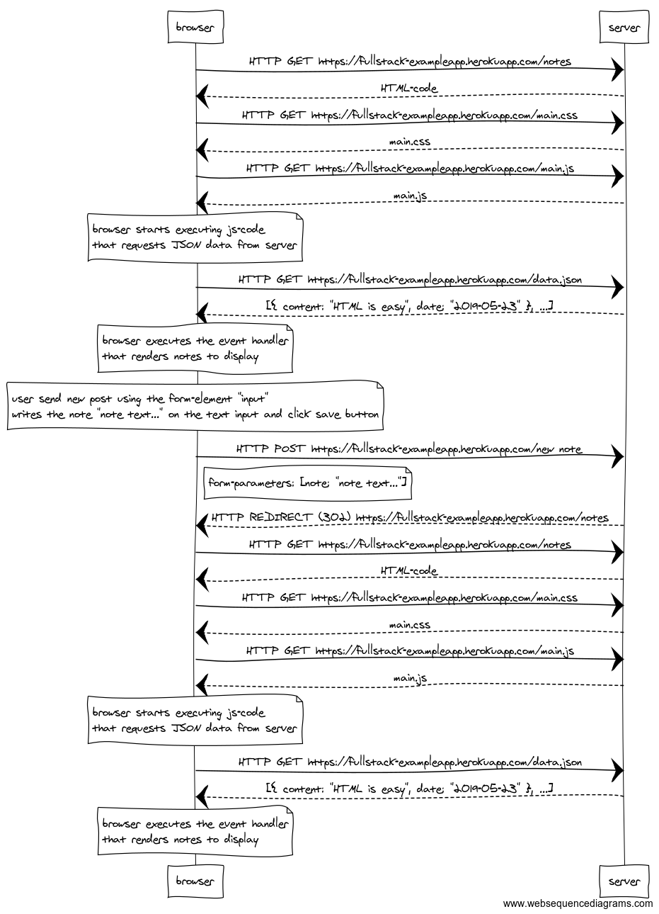

# 0.4: new note

In chapter Loading a page containing JavaScript - revised the chain of events caused by opening the page https://fullstack-exampleapp.herokuapp.com/notes is depicted as a sequence diagram

The diagram was made using websequencediagrams service as follows:
```code:
browser->server: HTTP GET https://fullstack-exampleapp.herokuapp.com/notes
server-->browser: HTML-code
browser->server: HTTP GET https://fullstack-exampleapp.herokuapp.com/main.css
server-->browser: main.css
browser->server: HTTP GET https://fullstack-exampleapp.herokuapp.com/main.js
server-->browser: main.js

note over browser:
browser starts executing js-code
that requests JSON data from server 
end note

browser->server: HTTP GET https://fullstack-exampleapp.herokuapp.com/data.json
server-->browser: [{ content: "HTML is easy", date: "2019-05-23" }, ...]

note over browser:
browser executes the event handler
that renders notes to display
end note
```

Create a similar diagram depicting the situation where the user creates a new note on page https://fullstack-exampleapp.herokuapp.com/notes by writing something into the text field and clicking the submit button.

If necessary, show operations on the browser or on the server as comments on the diagram.

The diagram does not have to be a sequence diagram. Any sensible way of presenting the events is fine.

All necessary information for doing this, and the next three exercises, can be found from the text of this part. The idea of these exercises is to read the text through once more, and to think through what is going on where. Reading the application code is not necessary, but it is of course possible. 

## Solution:

### Secuence Diagram Image:



### Secuence Diagram Code:

```code:
note over browser:
user send new post using the form-element "input"
writes the note "note text..." on the text input and click save button
end note
browser->server: HTTP POST https://fullstack-exampleapp.herokuapp.com/new_note
note right of browser:
form-parameters: [note: "note text..."]
end note
server-->browser: HTTP REDIRECT (302) https://fullstack-exampleapp.herokuapp.com/notes 

browser->server: HTTP GET https://fullstack-exampleapp.herokuapp.com/notes
server-->browser: HTML-code
browser->server: HTTP GET https://fullstack-exampleapp.herokuapp.com/main.css
server-->browser: main.css
browser->server: HTTP GET https://fullstack-exampleapp.herokuapp.com/main.js
server-->browser: main.js

note over browser:
browser starts executing js-code
that requests JSON data from server 
end note

browser->server: HTTP GET https://fullstack-exampleapp.herokuapp.com/data.json
server-->browser: [{ content: "HTML is easy", date: "2019-05-23" }, ...]

note over browser:
browser executes the event handler
that renders notes to display
end note
```

